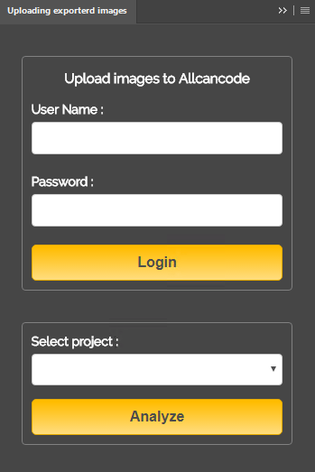
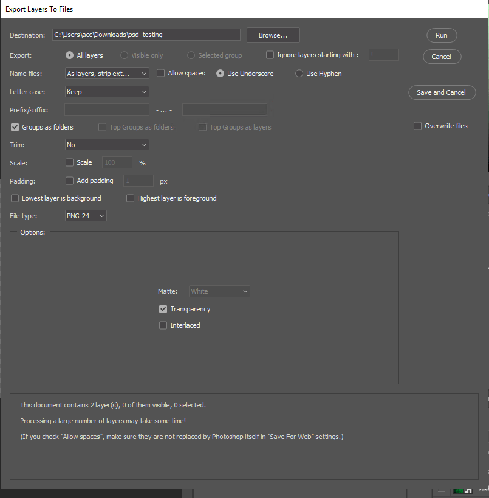

# About the repo
It is fork from this [link](https://github.com/hsw107/Photoshop-Export-Layers-to-Files-Fast) and exptended for AllCanCode's INC purposes.

# How to add it
First Login the remote Windows machine using the credentials given to you.
Copy all files under the Adobe (Windows) extensions in a newly created repository (give a name you like)
found in C:\Program Files (x86)\Common Files\Adobe\CEP\extensions\.
Then once you open a file to process under the Windows extesions you can see the newly create extension with the name you define in the previous step.
If not reopen Adobe's Photoshop.

# How to use it
* Make sure the server and acc-front are up and running ($ bash cli.sh remote, $ cd acc-front && bash devrun.sh)
* To open the plugin go to window explorer and select Window/Extensions/Uploading exporterd images and the window below should appear.

* Use the given username and password to login and obtain available projects found under the created account.
* Select project name from the dropdown box and the click analyze on the opened image (remember that layer should be all visible in order to extract them, if not set them).
* In the image below select the appropriate options and click run to export the assets

* The step above will also upload the exported images under the assets of the select project account.
* Then go to platform to view the assets.

# Do not forget
Execute npm i command to install all the necessary node modules.
Superagent must be installed globally ($ npm i -g superagent)
